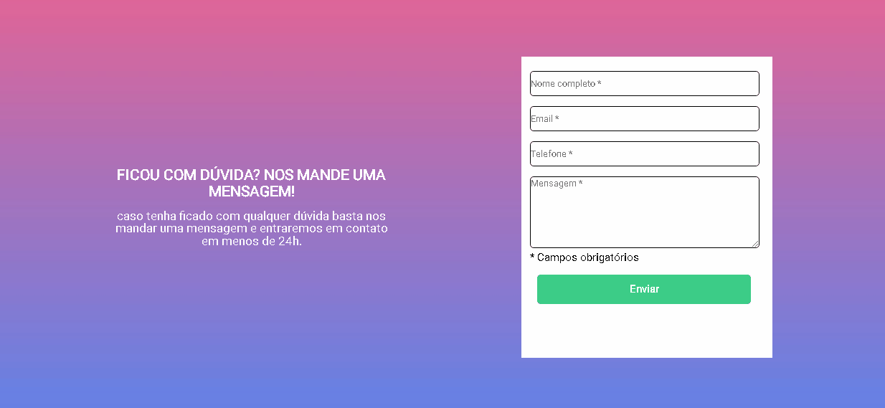

 <link rel="stylesheet" href="https://cdn.jsdelivr.net/gh/devicons/devicon@v2.15.1/devicon.min.css">
          

# Projeto de Formulário com Validação

## Tecnologias Utilizadas ✔

         
      
 

 ## Descricão: ✅

Este é um projeto simples que demonstra como criar um formulário HTML com validação usando HTML, CSS e JavaScript. O objetivo é garantir que todos os campos do formulário sejam preenchidos corretamente antes de permitir o envio do formulário. Se algum campo não for preenchido, uma mensagem de erro será exibida e o campo não preenchido será destacado em vermelho.
#
- projeto solicita que seja preenchido algumas informacoes no formulario:
- nome
- email
- numero
- mensagem;

- foi solicitado que fizesse uma validação caso alguma dos dados acima nao estives preenchido na hora de enviar deve aparecer uma texto abaixo do que nao foi preenchido informando que o campo e obrigatorio.

## projeto 

